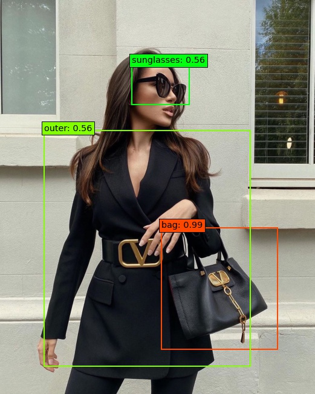

Università Politecnica delle Marche
Corso di Laurea Magistrale in Ingegneria Informatica e dell’Automazione
Dipartimento di Ingegneria dell’Informazione

# How to discorver trend on fashion domain
  
Through this work we have created models that can locate clothes within the images. To do this we used the Modanet dataset and the SSD neural network.

 - **Modanet**: [Github modanet with paper](https://github.com/eBay/modanet)
 - **SSD network**: [Paper SSD](https://arxiv.org/abs/1512.02325)
 - **FFSSD network**: [Paper SSD](https://arxiv.org/ftp/arxiv/papers/1709/1709.05054.pdf)

## The folder

The folder hierarchy:

 - **Dataset**:   Inside we find the code used to generate the dataset used for the realization of our models.
 - **SSD300**: Contains the code used to make the SSD300 model, the code was created from the Pierluigi Ferrari repository available at this [link](https://github.com/pierluigiferrari/ssd_keras)
 - **FFSSD**:   The folder contains the code of the FFSSD model we have created which integrates perfectly with the code written by Pierluigi Ferrari. To implement the feature fused module we chose the solution with element-sum
 - **Prediction&analysis_Instagram_Images**:   It contains the codes to carry out the analysis of trends on instagram using the [Instaloader](https://instaloader.github.io/) library.

## Dipendencies

 - Python 3.X
 - Tensorflow 1.15
 - Google Colab
 - Keras 2.2.3

